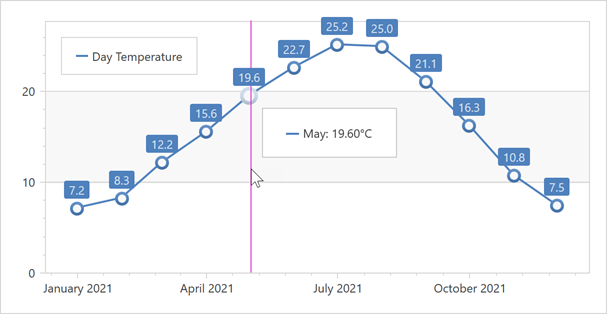

<!-- default badges list -->

<!-- default badges end -->

# Chart for WPF - Create a 2D Line Chart and Bind It to Data
 
The following example shows how to create a 2D Line chart.

Create a [ChartControl](https://docs.devexpress.com/WPF/DevExpress.Xpf.Charts.ChartControl) and set its [ChartControl.Diagram](https://docs.devexpress.com/WPF/DevExpress.Xpf.Charts.ChartControl.Diagram) property to an [XYDiagram2D](https://docs.devexpress.com/WPF/DevExpress.Xpf.Charts.XYDiagram2D) object. 

Add a [LineSeries2D](https://docs.devexpress.com/WPF/DevExpress.Xpf.Charts.LineSeries2D?p=netframework) object to the [Diagram.Series](https://docs.devexpress.com/WPF/DevExpress.Xpf.Charts.Diagram.Series) collection.

> Note that the `ChartControl.Diagram` and `Diagram.Series` are content properties. You can declare series in XAML directly after a diagram's declaration without wrapping them in opening and closing `ChartControl.Diagram` and `Diagram.Series` tags.

Use the following properties to bind the [series](https://docs.devexpress.com/WPF/6339/controls-and-libraries/charts-suite/chart-control/series/series) to data:

* [Series.DataSource](https://docs.devexpress.com/WPF/DevExpress.Xpf.Charts.Series.DataSource) - Specifies the series's data source.
* [Series.ArgumentDataMember](https://docs.devexpress.com/WPF/DevExpress.Xpf.Charts.Series.ArgumentDataMember) - Defines the data member that provides the series's arguments.
* [Series.ValueDataMember](https://docs.devexpress.com/WPF/DevExpress.Xpf.Charts.Series.ValueDataMember) - Specifies the data member that provides the series's values.

## Files to Look At

* [Window1.xaml](./CS/Window1.xaml) (VB: [Window1.xaml](./VB/Window1.xaml))
* [Window1.xaml.cs](./CS/Window1.xaml.cs) (VB: [Window1.xaml.vb](./VB/Window1.xaml.vb))

## Documentation

* [Line Chart](https://docs.devexpress.com/WPF/5869/controls-and-libraries/charts-suite/chart-control/series/2d-series-types/point-line-and-bubble-series/line)
* [Series](https://docs.devexpress.com/WPF/6339/controls-and-libraries/charts-suite/chart-control/series/series)

## More Examples

* [How to: Create a Real-Time Chart](https://github.com/DevExpress-Examples/dxcharts-how-to-create-a-real-time-chart)
* [How to: Select a Series Point Marker Based on a Point Argument](https://github.com/DevExpress-Examples/select-a-series-point-marker-based-on-a-point-argument)